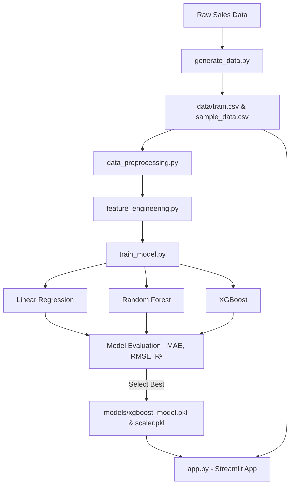

# 📈 Retail Demand Forecasting & Price Optimization Platform

[](https://www.python.org/)
[](https://streamlit.io/)
[](https://scikit-learn.org/)
[](https://xgboost.readthedocs.io/)
[](https://huggingface.co/spaces)

A complete end-to-end Retail Demand Forecasting and Price Optimization Platform. The platform uses historical daily store-item transaction data combined with synthetic pricing variations to:
1. **Forecast future product demand** using advanced Machine Learning (XGBoost Regressor).
2. **Perform price optimization** by simulating price elasticity, identifying the optimal price point that maximizes daily revenue.

---

## 🌟 Features

*   **Interactive Forecast Panel**: Filter by Store ID, Item ID, Date, and set a custom price to instantly see forecasted demand and expected revenue.
*   **Dual Dashboard Architecture**:
    1.  **Demand Forecasting View**: Shows prediction metrics, historical sales trend lines (Plotly), monthly sales seasonality, and feature importances.
    2.  **Price Optimization View**: Models the demand-curve (Price vs. Demand) and revenue curve (Price vs. Revenue) to pinpoint the exact pricing sweet spot.
*   **Actionable Pricing Insights**: Provides automated recommendations indicating if the current price should be increased or decreased to capture extra revenue.
*   **Downloadable Reports**: Download forecasted records directly as a CSV file.
*   **Modular Pipeline**: Structured notebooks for development (EDA, Preprocessing, Training) and clean, production-ready scripts in `src/`.

---

## 📊 Dataset Description

The application processes daily store-item sales records containing:
*   `date`: Transaction date (YYYY-MM-DD)
*   `store`: Store identifier (Store 1, Store 2, Store 3)
*   `item`: Item identifier (Item 1 to Item 5)
*   `price`: Selling price ($)
*   `sales`: Units sold (Target variable)

### Engineered Features
To capture temporal dynamics and autocorrelation, the pipeline engineers the following features:
*   **Date Features**: Year, Month, Week, Day, Day of Week, Quarter, Is Weekend.
*   **Lag Features**: Sales volume from 7, 14, and 30 days ago.
*   **Rolling Mean Features**: 7-day, 14-day, and 30-day rolling averages of past sales (shifted to avoid data leakage).

---

## ⚙️ Architecture



---

## 📈 Model Performance

Evaluation was conducted using a chronological train-test split (Train: 2022-01-01 to 2025-05-31; Test: 2025-06-01 to 2025-12-31) to prevent lookahead bias:

| Model | MAE (Units) | RMSE (Units) | R² Score |
| :--- | :---: | :---: | :---: |
| **XGBoost Regressor** | **10.1368** | **14.2168** | **0.9535** |
| Random Forest Regressor | 11.7773 | 17.7959 | 0.9272 |
| Linear Regression | 12.8905 | 20.2919 | 0.9053 |

*XGBoost was chosen as the production model due to its superior error minimization and \(R^2\) score.*

---

## 🖥️ Screenshots

*(Placeholder for dashboard UI visualization. Run the app locally to interact with the plots).*

*   **Forecasting Tab**:
    
*   **Correlation & Seasonality**:
    

---

## 🚀 Installation & Local Execution

### Prerequisites
*   Python 3.10+ installed

### Step-by-Step Setup

1.  **Clone the Repository**:
    ```bash
    git clone <your-repository-url>
    cd Retail-Demand-Forecasting
    ```

2.  **Install Dependencies**:
    ```bash
    pip install -r requirements.txt
    ```

3.  **Generate Data**:
    ```bash
    python src/generate_data.py
    ```

4.  **Train Models**:
    ```bash
    python -m src.train_model
    ```

5.  **Run Streamlit Dashboard**:
    ```bash
    streamlit run app.py
    ```

---

## 🤗 Hugging Face Spaces Deployment

To deploy this platform onto Hugging Face Spaces:

1.  **Create a Hugging Face Space**:
    *   Navigate to [huggingface.co/new-space](https://huggingface.co/new-space)
    *   Set the SDK type to **Streamlit**.

2.  **Initialize Git & Push to Space**:
    ```bash
    # Run from the project root directory
    git init
    git add .
    git commit -m "Initial commit of forecasting and optimization platform"
    
    # Add Hugging Face Space as a remote and push (or sync via GitHub Actions)
    git remote add origin https://huggingface.co/spaces/<your-username>/<your-space-name>
    git branch -M main
    git push -u origin main -f
    ```

*Note: Since the dataset is generated dynamically and models are trained locally, ensure you include `models/xgboost_model.pkl` and `models/scaler.pkl` in the deployment, or modify the `.gitignore` before pushing to Hugging Face if you want the models tracked in Git LFS.*
